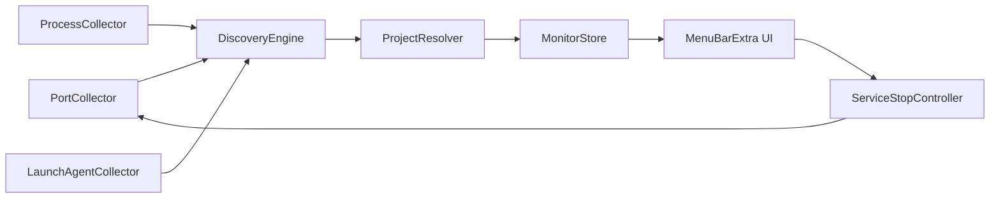
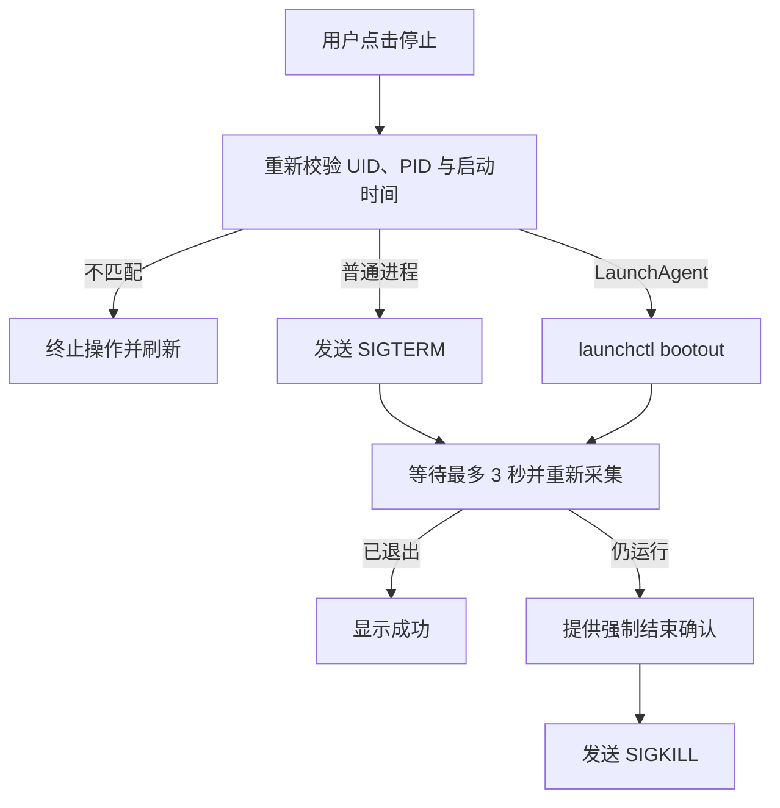

# Agent Monitor 架构设计

日期：2026-06-22  
状态：已确认

## 1. 目标

Agent Monitor 是运行在 macOS 菜单栏中的本地工具。它自动发现当前登录用户拥有的后台服务、本地网页开发服务器和监听端口，持续展示内存占用，并允许用户停止对应服务。

首版只处理当前用户进程，不读取或操作 root、其他用户及系统守护进程。

## 2. 功能范围

### 2.1 首版包含

- 自动发现当前用户的 TCP 监听端口和已绑定 UDP 端口。
- 识别 `~/Library/LaunchAgents` 中正在运行的用户 daemon。
- 识别 Vite、Next.js、Python、Go 等本地网页项目。
- 根据进程工作目录、启动命令和项目标记文件推断项目名称。
- 将同一进程或同一项目的多个端口归并展示。
- 展示名称、类型、端口、协议、PID、命令、工作目录和实时内存占用。
- 约每 2 秒刷新一次状态。
- 对普通进程执行优雅停止，并在超时后提供强制结束。
- 对用户 LaunchAgent 使用 `launchctl` 停止，避免 KeepAlive 立即拉起。

### 2.2 首版不包含

- 系统级 daemon、root 进程或其他用户进程。
- 远程主机监控、流量统计和历史趋势。
- 手动登记项目目录。
- 自动重启服务或修改 LaunchAgent 配置。
- 关闭同一进程中的单个端口；停止进程会释放它拥有的全部端口。

## 3. 非功能要求

| 类别 | 目标 |
| --- | --- |
| 平台 | macOS 14 Sonoma 或更高版本 |
| 刷新 | 默认 2 秒；状态变化在下一轮刷新内显示 |
| 性能 | 典型开发机单轮采集目标低于 500 ms；后台平均 CPU 目标低于 1% |
| 内存 | 应用自身稳定占用目标低于 80 MB |
| 权限 | 不要求管理员权限；仅操作当前 UID 的进程 |
| 隐私 | 数据仅保存在内存中，不上传、不记录命令历史 |
| 可用性 | 单个数据源失败时保留其他来源结果，并在界面显示降级状态 |

性能数字是首版验收目标，需通过实际设备测试校准，而不是架构承诺。

## 4. 总体架构



应用采用单进程、分层的原生 Swift 架构：

- `PortCollector`：读取 TCP 监听和 UDP 绑定信息，输出端口与 PID 的关系。
- `ProcessCollector`：校验进程 UID，读取路径、参数、工作目录、启动时间和内存。
- `LaunchAgentCollector`：扫描用户 LaunchAgent plist，并解析当前运行状态。
- `DiscoveryEngine`：合并采集结果，丢弃非当前用户及已退出的进程。
- `ProjectResolver`：从工作目录向上查找项目标记文件，推断项目根目录和名称。
- `MonitorStore`：负责定时刷新、快照差异比较、加载状态和错误状态。
- `ServiceStopController`：执行停止、等待退出、重新采集和强制结束确认。
- `MenuBarExtra UI`：按本地项目、用户 daemon、其他用户端口分组展示。

## 5. 数据采集方案

### 5.1 端口

首版调用系统自带的 `/usr/sbin/lsof`，使用字段模式输出，采集 TCP `LISTEN` 和具有本地端口的 UDP socket。选择 `lsof` 是为了降低首版对 Darwin 私有或复杂 socket API 的依赖；解析器必须使用固定字段并以测试样例覆盖，不解析面向人的表格文本。

如果实际性能不满足目标，再将端口采集器替换为原生实现。上层只依赖 `PortCollecting` 协议，不感知数据来源。

### 5.2 进程与内存

使用 Darwin `libproc` API 获取进程路径、工作目录、启动信息和资源占用。内存主指标使用 physical footprint；无法获取时降级为 resident size。每次展示或执行停止前都重新校验进程 UID。

### 5.3 用户 LaunchAgent

读取 `~/Library/LaunchAgents/*.plist` 获取 label 和启动配置，再通过 `/bin/launchctl print gui/<uid>/<label>` 判断运行状态并关联 PID。无效或无法解析的 plist 只产生局部错误，不中断其他采集。

### 5.4 本地项目识别

从进程工作目录向父级查找最近的项目标记：`.git`、`package.json`、`pyproject.toml`、`go.mod` 或 `Cargo.toml`。名称优先取 manifest 中明确的项目名，其次使用根目录名。相同项目根目录的进程归为一组，但仍保留每个进程和端口的明细。

## 6. 数据模型

```text
MonitoredService
├── id: ServiceIdentity
├── displayName: String
├── kind: localProject | launchAgent | userProcess
├── projectRoot: URL?
├── processes: [MonitoredProcess]
├── endpoints: [ListeningEndpoint]
└── memoryBytes: UInt64

MonitoredProcess
├── pid: pid_t
├── ownerUID: uid_t
├── startTime: Date
├── executablePath: String
├── arguments: [String]
├── workingDirectory: URL?
└── memoryBytes: UInt64
```

进程标识使用 `PID + 启动时间`，避免 PID 被系统复用后误杀无关进程。

## 7. 停止流程



当一个进程拥有多个端口时，确认界面必须列出所有受影响端口。强制结束永远不是第一次操作。

## 8. UI 结构

菜单栏入口使用 SwiftUI `MenuBarExtra` 的 window 样式。弹窗默认宽度约 360 点，按以下顺序展示：

1. 顶部摘要：服务数、端口数、刷新状态。
2. 本地项目。
3. 用户 LaunchAgent。
4. 其他当前用户监听进程。
5. 底部操作：刷新、设置开机启动、退出。

“设置开机启动”只有在使用 `SMAppService` 实现后才显示；不在初始化骨架中提前加入。

## 9. 失败模式与处理

| 失败 | 行为 |
| --- | --- |
| `lsof` 超时或退出失败 | 保留上一次端口快照并标记端口数据过期 |
| 某个进程在采集中退出 | 忽略该进程，下一轮刷新收敛 |
| 无法读取进程详情 | 展示可获得的端口和 PID，字段标记未知 |
| LaunchAgent plist 无效 | 跳过单项并记录诊断信息 |
| SIGTERM 无权限或 PID 已复用 | 不升级为 SIGKILL，显示原因并刷新 |
| LaunchAgent 被外部重新加载 | 下一轮重新显示，不擅自修改其配置 |

## 10. 安全与分发

- 应用不启用 App Sandbox，因为需要检查同 UID 进程、执行系统工具并发送信号。
- 启用 Hardened Runtime，使用 Developer ID 签名和 Apple 公证后直接分发。
- 不安装 privileged helper，不请求管理员密码。
- 所有停止操作限制为当前有效 UID，并在操作前校验进程启动时间。
- 命令执行使用固定绝对路径和参数数组，不通过 shell 拼接用户输入。

## 11. 测试策略

- 单元测试：`lsof` 字段解析、项目根目录识别、服务归并和排序。
- 进程测试：启动测试子进程监听随机端口，验证发现、内存读取和 SIGTERM。
- 安全测试：模拟 PID 复用、UID 不匹配和数据读取失败，确认不会发送信号。
- UI 测试：空状态、多项目、多端口、采集降级和停止确认。
- 手工验证：真实 Vite/Next.js 服务与临时用户 LaunchAgent。

## 12. 验收标准

- 新启动的当前用户本地服务在 3 秒内出现。
- 同一项目的多个进程和端口归并正确。
- 内存数据每轮刷新且不会因单个进程退出导致界面错误。
- 优雅停止能释放测试端口；多端口停止前有明确提示。
- 非当前用户或启动时间不匹配的进程不会被终止。
- 应用持续运行 8 小时无明显内存增长或刷新任务叠加。

